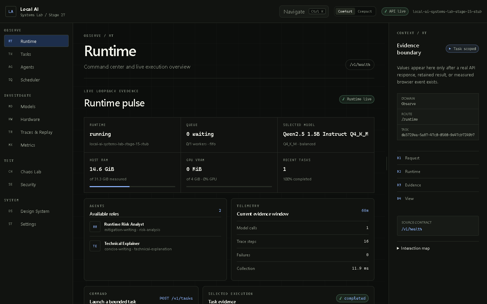

# Local AI Systems Lab

A fully local, inspectable AI runtime and engineering workbench built for an RTX
3050 laptop GPU with 4 GB VRAM. It demonstrates the mechanics usually hidden by
agent frameworks: explicit states, bounded scheduling, memory admission,
adaptive llama.cpp profiles, explainable model routing, exact-grant tools,
SQLite recovery, hash-chained traces, deterministic replay, chaos/security
experiments, observability, and a real React operations interface.



## What This Demonstrates

- A custom Python runtime executes specialized agents through validated state
  transitions rather than direct model calls.
- A bounded FIFO/priority scheduler exposes queue order, cancellation, deadlines,
  aging, and worker metrics.
- Hardware-aware admission and adaptive profiles make 4 GB VRAM constraints an
  inspectable policy decision.
- A model registry/router explains availability, selection, rejection, and
  compute budgets.
- Exact-grant read-only tools, deterministic security controls, and controlled
  chaos experiments demonstrate both allowed and denied behavior.
- SQLite persistence, checkpoints, killed-worker recovery, hash-chained traces,
  and side-effect-free replay make execution debuggable.
- A Systems Cartography React workbench projects real loopback API evidence
  without inventing telemetry or becoming a chat clone.

## Architecture at a Glance

```text
React workbench
  -> loopback HTTP/JSON + task-scoped SSE
  -> transport-independent runtime service
  -> agent + state machine
  -> admission -> scheduler -> router/profile -> llama.cpp
  -> exact-grant tools
  -> SQLite persistence + metrics + hash-chained trace/replay
```

The flagship is a Python-first modular monolith. Core protocols do not depend on
React, HTTP, SQLite, or llama.cpp details; adapters remain replaceable and
interview-visible. See the full [architecture](docs/architecture.md) and
[systems design](docs/portfolio/systems-design.md).

## Five-Minute Demo

```powershell
.\setup_and_run.bat --stub
```

Open `http://127.0.0.1:4173/runtime`, launch a task, follow it through Scheduler,
inspect/replay its Trace, investigate Hardware/Metrics, run the Safe Tool Probe,
then open Chaos and Security. Stub mode is deterministic product evidence; the
retained release gate separately proves one real Qwen/llama.cpp inference. Use
the exact [demo workflow](docs/portfolio/demo-workflow.md).

## Measured Evidence

| Release measurement | Result |
| --- | ---: |
| Backend tests | 154 passed |
| Frontend tests | 39 passed |
| Real local inference | 1,801.341 ms TTFT; 103.47 tokens/s |
| Peak process RAM / VRAM delta | 1,343.680 MiB / 1,189 MiB |
| Safe tool execution | 2.531 ms |
| Browser product flow | 8 routes; 65,656.979 ms |
| Frontend bundle | 150,997 / 256,000 gzip bytes |
| Release gate | All required categories PASS; `release_candidate=true` |

Overall maturity remains `PARTIAL`. Read the [methodology and results](docs/portfolio/benchmark-methodology-and-results.md)
and inspect the retained [Stage 26 evidence](benchmarks/results/stage26-product-acceptance-20260827T101438Z.json).

## Portfolio Documentation

- [Portfolio release map](docs/portfolio/README.md)
- [Setup and reproducibility](docs/portfolio/setup-and-reproducibility.md)
- [Demo workflow and screenshots](docs/portfolio/demo-workflow.md)
- [Benchmark methodology and results](docs/portfolio/benchmark-methodology-and-results.md)
- [Scheduler, routing, persistence, and recovery design](docs/portfolio/systems-design.md)
- [Security model and chaos testing](docs/portfolio/security-and-chaos.md)
- [Frontend design rationale](docs/portfolio/frontend-design-rationale.md)
- [Failed experiments](docs/portfolio/failed-experiments.md)
- [Interview questions and answers](docs/portfolio/interview-guide.md)
- [Stage 27 completion report](docs/stages/stage27-portfolio-and-interview-release.md)
- [ADRs](docs/adr/README.md), [risk register](docs/risks.md), and [project state](PROJECT_STATE.md)

## Known Limits

- Single-user loopback release only; no authentication, TLS, remote deployment,
  or multi-user ownership.
- One installed real model backend; semantic accuracy/evaluation is incomplete.
- A reproduced terminal-state/output transaction gap keeps recovery `PARTIAL`.
- Application controls are not an OS sandbox or security certification.
- Automated accessibility evidence is not human screen-reader conformance.
- Python 3.10 is verified; a Windows SQLite fault-cleanup issue remains on 3.11.

## Current status

- Last completed stage: Stage 27 — Portfolio & Interview Release
- Next approval-gated stage: None — planned roadmap complete
- Product acceptance: RELEASE CANDIDATE for single-user loopback use; all required checks PASS, overall maturity PARTIAL
- Frontend Runtime, Agent, Scheduler, Trace, Replay, Hardware, Metrics, Chaos, Security, and Safe Tool Probe flows: COMPLETE

See [PROJECT_STATE.md](PROJECT_STATE.md) for the source-of-truth status.

## Run the Portfolio Release

On Windows, the root launcher performs setup, starts the backend first, waits
for its health check, then starts the frontend and opens the Runtime page:

```powershell
.\setup_and_run.bat
```

The default uses the project's real pinned llama.cpp/Qwen backend. Use
`.\setup_and_run.bat --stub` for the deterministic development backend, or add
`--with-ollama` to start Ollama as an optional separate service. Ollama is not a
replacement for the measured llama.cpp backend. Run `setup_and_run.bat --help`
for setup, browser, and dependency options. Healthy matching services are
reused; occupied or mismatched ports are reported and never terminated.

Start the local-only deterministic API from the repository root:

```powershell
python -m runtime.api_cli --stub --database data/stage26-dev.db
```

In a second terminal:

```powershell
cd apps/web
npm install
npm run dev
```

Open `http://127.0.0.1:4173/runtime`, `/agents`, `/scheduler`, or
`/traces?task=<task-id>`, `/hardware`, `/metrics`, `/chaos`, or `/security`. The workbench reads real health,
scheduler, hardware, model, agent, and metric evidence through the loopback
proxy. It can launch one bounded task, retain its selected ID in the URL, follow
ordered SSE lifecycle events, show truthful output/measurements, and request
cooperative cancellation. It does not fabricate a task history the API lacks.

Validate the portfolio documents, local links, screenshot dimensions, and exact
retained evidence claims:

```powershell
python scripts\validate_portfolio_release.py
```

The command writes a timestamped machine-readable Stage 27 result under
`benchmarks/results/`. See the [Stage 27 report](docs/stages/stage27-portfolio-and-interview-release.md)
and [ADR-0027](docs/adr/0027-evidence-indexed-portfolio-release.md).

Validate the frontend foundation:

```powershell
npm test
npm run build
npm run check:bundle
npm run smoke:stage25
```

The Stage 25 suite has thirty-eight component tests, including focus return,
skip navigation, reduced motion, a 10,000-step trace, a 500-event stream burst,
slow-backend states, and every prior specialist-route/axe check. Its smoke
verifies all twelve routes, calculated token contrast, responsive/reduced-motion
contracts, stream batching/bounds, the compressed bundle, loopback health, and
persistence integrity. Read the [Stage 25 report](docs/stages/stage25-responsive-accessibility-performance-pass.md)
and [ADR-0025](docs/adr/0025-container-aware-accessible-bounded-rendering.md).

Run the complete Stage 26 product gate from the repository root:

```powershell
python -m benchmarks.run_stage26_product_acceptance
```

The retained Stage 26 run passed 154 backend tests, 39 frontend tests, one real
Qwen/llama.cpp inference, eight browser routes, exact safe-tool policy and
trace/replay, five fail-closed HTTP cases, an injected visible API outage and
recovery, zero automated WCAG A/AA violations, the production build/bundle gate,
and completed-task rendering after API restart. Read the [Stage 26 report](docs/stages/stage26-end-to-end-product-verification.md)
and [ADR-0026](docs/adr/0026-isolated-full-story-product-acceptance.md).

## Review the Stage 17 frontend research

Read [the frontend research and recommendation](docs/frontend-research.md) for
28 current references covering official Google work, recent browser capabilities,
developer and observability interfaces, and maintained React implementation
candidates. It recommends a custom Systems Cartography direction, a lean
accessible/virtualized stack, explicit performance and accessibility constraints,
and a list of rejected or deferred ideas.

The research is retained as the decision evidence behind the Stage 18 shell and
Stage 19 Runtime Command Center.

## Run the Stage 16 backend acceptance gate

Execute the complete build/package, test, control, scheduler, hardware, recovery,
trace, observability, chaos, security, deterministic API, and real-model API gate:

```powershell
python -m benchmarks.run_stage16_acceptance
```

The retained run executed 14 commands, passed all 14 mandatory categories, ran
150 tests, completed one real Qwen/llama.cpp API task, and passed five regression
limits. The backend is a release candidate for single-user loopback frontend
work, but overall maturity remains `PARTIAL`: the terminal-output atomicity gap,
one-real-model/semantic-evaluation boundary, and application-level security limit
remain explicit. See the [Backend Acceptance Report](docs/backend-acceptance-report.md)
and [Stage 16 report](docs/stages/stage16-backend-verification-acceptance-gate.md).

## Operate the Stage 15 backend API

Start the deterministic full-runtime composition with zero real LLM calls:

```powershell
python -m runtime.api_cli --stub
```

Start the real guarded Qwen/llama.cpp composition:

```powershell
python -m runtime.api_cli
```

The loopback base URL is `http://127.0.0.1:8765/v1`; its OpenAPI document is at
`/v1/openapi.json`. The contract creates/inspects/cancels tasks, streams lifecycle
events over SSE, and inspects agents, scheduler, hardware, models, metrics,
redacted traces/replay, isolated chaos results, and retained security evidence.
It serves no static files and is not an internet-facing production server.

Run the separate-process external evidence workflow:

```powershell
python -m benchmarks.run_stage15_api
```

The retained deterministic run completed 16 HTTP/SSE operations with zero direct
runtime calls after launch and zero real LLM calls. A second retained real run
completed the same 16-operation workflow through Qwen2.5 1.5B/llama.cpp with one
real model call, valid trace replay, expected isolated chaos, zero retained
security failures, and SQLite integrity `ok`. See the
[Stage 15 report](docs/stages/stage15-backend-api-full-runtime-integration.md).

## Run Stage 14 adversarial tests

Run all 14 bounded cases or select individual cases:

```powershell
python -m runtime.security_cli
python -m runtime.security_cli --case prompt-injection --case tool-escalation
python -m benchmarks.run_stage14_security
```

The suite exercises input/output validation, prompt authority separation, path
allowlists, tool and network ceilings, secret redaction, subprocess rules,
timeouts, process limits, malformed structures, and resource abuse. Its retained
run passed 14/14 cases with zero real LLM calls and SQLite integrity `ok`.
Passing these tests does not prove the system is secure. See the
[Stage 14 report](docs/stages/stage14-security-adversarial-testing.md).

## Run Stage 13 chaos experiments

Fault injection is disabled by default. Explicitly arm one deterministic
scenario or the complete controlled suite:

```powershell
python -m runtime.chaos_cli --execute --scenario model-timeout
python -m runtime.chaos_cli --execute
python -m benchmarks.run_stage13_chaos
```

The report includes expected/actual state and error, injection evidence, traces,
latency relative to no-fault baselines, containment, task completion, recovery,
observability, and SQLite integrity. The retained suite matched 9/9 expected
outcomes and recovered its killed worker, while truthfully reporting the known
terminal-output database gap as not contained. See the
[Stage 13 report](docs/stages/stage13-fault-injection-chaos-framework.md).

## Inspect Stage 12 observability

Create controlled inference, tool, denied-operation, and recovery activity, then
emit one JSON report with task states, activity totals, latency/resource
distributions, live scheduler state, source-labelled hardware, and per-task drill-down:

```powershell
python -m runtime.observability_cli demo
python -m benchmarks.run_stage12_observability
```

Query an existing local database without invoking a real model:

```powershell
python -m runtime.observability_cli report --database data/runtime-stage12.db
```

Missing measurements remain `null` with a zero sample count. Recovery attempts
are reported as retries because no separate generic retry subsystem exists. See
the [Stage 12 report](docs/stages/stage12-observability-metrics-backend.md).

## Inspect Stage 11 traces and replay

Run two equivalent deterministic-stub tasks, load their persisted traces,
integrity-check and replay the first, then compare both runs:

```powershell
python -m runtime.trace_cli demo
python -m benchmarks.run_stage11_trace_replay
```

Inspect or replay an existing trace without repeating model/tool effects:

```powershell
python -m runtime.trace_cli inspect --database data/runtime-stage11.db --task-id TASK_ID
python -m runtime.trace_cli replay --database data/runtime-stage11.db --run-id RUN_ID
```

Trace records include run/step identity, actor/component, UTC timestamp,
canonical input/output hashes, a hash chain, state/model/configuration/failure
metadata, and an explicit determinism class. See the
[Stage 11 report](docs/stages/stage11-execution-trace-deterministic-replay.md).

## Inspect Stage 10 persistence and recovery

Launch a checkpointed worker, terminate its process, restart against the same
SQLite database, and recover the original task:

```powershell
python -m runtime.recovery_cli
```

Retain a compact recovery result:

```powershell
python -m benchmarks.run_stage10_recovery
```

Real agent execution now uses the ignored `data/runtime-stage15.db` database by
default. Use `--database` to select another local database. See the
[Stage 10 purpose, component map, recovery contract, and evidence](docs/stages/stage10-persistence-checkpoints-recovery.md).

## Inspect Stage 9 routing and budgets

Show truthful live model availability, explained routes, controlled two-model
route differences, token capping, and a zero-call budget rejection:

```powershell
python -m runtime.routing_cli
```

Retain the controlled routing comparison:

```powershell
python -m benchmarks.run_stage9_routing
```

Real agent results now include `route`, `compute_budget`, `compute_usage`, exact
profile/admission evidence, scheduler measurements, and inference metrics. See
the [Stage 9 purpose, component map, evidence, and limits](docs/stages/stage9-model-registry-router-budgets.md).

## Inspect Stage 8 adaptive inference

Show the four explicit profiles, live workload selections, and controlled
pressure/missing-telemetry behavior without loading the model:

```powershell
python -m runtime.adaptive_cli
```

Run a real standard or background agent so the selected profile is applied to
llama.cpp and returned with its measurements:

```powershell
python -m runtime.agent_cli --agent technical-explainer --workload standard
python -m runtime.agent_cli --agent technical-explainer --workload background
```

Run the same real prompt through every profile:

```powershell
python -m benchmarks.run_stage8_profiles --runs-per-profile 1
```

See the [Stage 8 purpose, component map, and measured comparison](docs/stages/stage8-adaptive-inference-controller.md).

## Inspect Stage 7 hardware and admission

Capture current resource evidence, inspect the baseline estimate and measured
error, and exercise all six controlled admission outcomes:

```powershell
python -m runtime.hardware_cli
```

The live result is evaluated before Stage 6 scheduler submission. Only `ACCEPT`
executes; other decisions carry a recommendation and enter `RESOURCE_BLOCKED`.
See the [Stage 7 purpose and component upgrade map](docs/stages/stage7-hardware-profiler-admission.md).

## Run the Stage 6 scheduler comparison

Submit the same background, standard, and interactive workload under FIFO and
priority policies, then inspect execution order and queue metrics:

```powershell
python -m runtime.scheduler_cli
```

The FIFO path preserves submission order. The priority path executes interactive
work first, while aging and a maximum-wait promotion protect old background work.
See the [Stage 6 purpose and component upgrade map](docs/stages/stage6-request-scheduler.md).

## Run the Stage 5 tool runtime

Run one permitted read-only request and one expected denied request without
loading the model:

```powershell
python -m runtime.tool_cli --demo
```

Run one explicit typed request:

```powershell
python -m runtime.tool_cli --agent technical-explainer --tool project_context_read --arguments '{"relative_path":"README.md","max_characters":600}'
```

The safe tools can read only approved UTF-8 text below the resolved project
root. Exact per-agent grants and required permission names are checked before
execution. See the [Stage 5 purpose and component upgrade map](docs/stages/stage5-tool-runtime-permissions.md).

## Run the real agent runtime

Python 3.10 or newer, PowerShell 7, the Hugging Face CLI, and a compatible
NVIDIA GPU/driver are required for the pinned Windows CUDA baseline. Install
and verify the ignored native/model artifacts:

```powershell
pwsh -NoProfile -File .\scripts\setup_stage2.ps1
```

Run both specialized agents through task creation, validated state transitions,
policy, routing, adaptive profile selection, profile-specific admission, the bounded priority scheduler, real model invocation,
validation, and lifecycle events:

```powershell
python -m runtime.agent_cli
```

Run one agent with an overridden objective:

```powershell
python -m runtime.agent_cli --agent technical-explainer --objective "Explain GGUF in 30 words."
```

Each result includes `state_history`, normally:

```text
created -> planning -> executing -> validating -> completed
```

See the [Stage 4 state-machine report](docs/stages/stage4-explicit-state-machine.md).

## Run direct local inference

Generate locally and print the result plus measurements as JSON:

```powershell
python -m runtime.inference_cli --prompt "Explain why local inference can improve privacy." --json
```

Run the tracked five-prompt baseline:

```powershell
python -m benchmarks.run_stage2_baseline --runs-per-prompt 1
```

The setup is pinned to llama.cpp `b10566` and the Q4_K_M file from
the Apache-2.0-licensed `Qwen/Qwen2.5-1.5B-Instruct-GGUF`; exact revisions and SHA-256 values live in
[`configs/inference-baseline.json`](configs/inference-baseline.json).

## Run the deterministic lifecycle

Python 3.10 or newer is required. The skeleton has no third-party runtime
dependencies.

```powershell
python -m runtime --objective "Demonstrate one local task"
```

The command prints JSON lifecycle events for:

```text
runtime.started -> task.created -> task.completed -> runtime.stopped
```

This regression path remains clearly marked `STUB (no LLM inference)` and
reports zero real LLM calls.

Run all tests:

```powershell
python -m unittest discover -s tests -v
```

## Engineering documentation

- [Repository map](docs/repository-map.md)
- [Architecture baseline](docs/architecture.md)
- [Frontend research](docs/frontend-research.md)
- [Frontend design system and UI architecture](docs/frontend-design-system.md)
- [Environment report](docs/environment.md)
- [Development commands](docs/development.md)
- [Risk register](docs/risks.md)
- [Stage 2 benchmark report](docs/benchmarks/stage2-local-inference-baseline.md)
- [Architecture decisions](docs/adr/README.md)

## Verify this machine

From PowerShell:

```powershell
pwsh -NoProfile -File .\scripts\check_environment.ps1
```

The script is read-only. It reports relevant local hardware and tool versions;
it does not install dependencies, start services, or download models.
