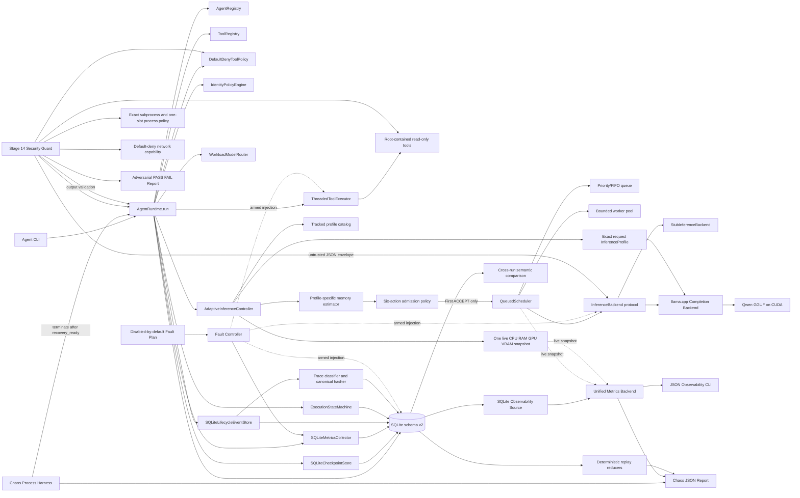

# Architecture Baseline through Stage 21

## Status and scope

Stage 16 adds no new runtime execution path. It verifies the complete Stage 15
loopback API composition and all earlier security, chaos, observability, tracing,
recovery, routing, admission, scheduling, and inference boundaries through one
versioned acceptance manifest and retained release-candidate result.

Stage 17 adds no execution path. It researches the future frontend against the
accepted API and recommends a Systems Cartography direction. Stage 18 implements
that direction as a local client-rendered React shell with a design token system,
twelve URL-addressable domains, accessible primitives, a responsive resizable
workspace/evidence relationship, and explicit no-data states. Stage 19 connects
the runtime route to real loopback JSON and SSE. Stage 20 projects that same
evidence into task-aware Agent and Scheduler views while leaving the backend and
core runtime execution paths unchanged. Stage 21 projects the existing safe
trace and bounded replay API into a searchable, step-addressable debugger; it
also leaves backend behavior unchanged.

## Stage 19 frontend boundary

The implemented shell and approved future integration boundary remain outside
the runtime package:

```text
local React browser shell (implemented Stage 18)
  -> typed TanStack Query HTTP owner (implemented Stage 19)
  -> bounded task-scoped EventSource adapter (implemented Stage 19)
  -> versioned loopback /v1 API
  -> existing Stage 15 transport-independent service
  -> accepted Stage 1–14 runtime components
```

URL state, server/query state, SSE lifecycle state, ephemeral
viewer selection, and versioned device preference have separate owners. The
browser persists density only; the selected task is URL state and runtime data
remains server-owned. A graph, chart, timeline, or resizable pane
must remain a presentation of the real API contract rather than a second source
of runtime truth.

The Runtime Command Center starts six independent inspection queries in parallel.
Health, scheduler, hardware, metrics, agents, and models use resource-specific
polling cadences. Task mutations seed/invalidate query evidence. The selected
task stream is deduplicated, capped at 200 events, reconnects a continuing timed-
out stream with `after=<cursor>`, and closes after terminal evidence.

## Stage 20 projection boundary

`/agents` and `/scheduler` share only the validated task ID in URL state. Each
view independently consumes the deduplicated task, agent, scheduler, and active
SSE query owners. Agent state comes from durable terminal `state_history`, or
from the bounded lifecycle stream while active. Scheduler placement comes from
the live process snapshot when present and the selected terminal task's retained
result metadata after snapshot eviction. Missing stub admission remains null.

The worker/queue map, state path, execution handoff, admission panel, and request
ledger are semantic HTML list/table projections with CSS presentation. No graph
library or browser-side history store was added. The request ledger is capped at
50 reported rows; it is not a global task-history claim.

## Stage 21 trace and replay boundary

`/traces` consumes `GET /v1/tasks/{task_id}/trace` for the same validated
URL-selected task. An optional validated `?step=` owns only the expanded row;
search, kind, determinism, component, and page remain ephemeral viewer state.
Active tasks poll their trace at one second; terminal traces do not poll.

The timeline presents recorded order, actors, components, state transitions,
model identifiers, content hashes, chain links, safe failures, and exact gaps
between recorded timestamps. A gap is labelled `Δ`; it is not claimed as step
execution latency because the API does not report per-step duration. Raw inputs,
outputs, run metadata, and failure details remain absent by API policy.

The browser renders at most 100 filtered rows per page and defers search while
memoizing derived component, gap, index, and replay maps. Replay begins only
after an explicit user action against `POST /v1/traces/{run_id}/replay`.
Deterministic reducers may match or diverge, nondeterministic/observational work
is observed, and side-effecting tools are skipped rather than re-executed. The
API exposes no cross-run comparison contract, so the interface says comparison
is unavailable instead of deriving a false result.

## Context and planned flow



The Stage 1 control flow remains unchanged when the stub is composed. The
Stage 2 inference path is:

1. A typed configuration resolves pinned executable/model paths and validates
   inference settings.
2. Backend startup verifies both SHA-256 hashes and reads the llama.cpp version.
3. A request becomes a raw Qwen ChatML prompt and a bounded native command.
4. One `llama-completion` subprocess starts in offline mode with all model
   layers offloaded to the GPU.
5. Separate readers drain stdout/stderr; text is yielded incrementally while
   llama.cpp timing lines and resource samples are collected.
6. A final chunk carries load, TTFT, prompt, generation, total-time, RAM, and
   VRAM measurements. Cancellation terminates and reaps the owned process.

Only one native inference may run per backend instance. The Stage 6 real
composition therefore configures one scheduler worker instead of admitting
concurrency the backend cannot safely execute.

Stage 3 wraps that path as follows:

1. `AgentRegistry` resolves a stable specialized identity.
2. `AgentRuntime.run()` creates an owned task from the agent/default objective.
3. The runtime requests validated transitions and records ordered history,
   checkpoints, and timestamped lifecycle events.
4. Identity policy and static routing execute through the existing boundaries.
5. The agent system prompt is attached to the inference request.
6. The result carries agent identity, objective, final state, declared
   capabilities, backend metadata, and Stage 2 measurements.
7. Missing/duplicate agents, foreign tasks, illegal transitions, policy denial,
   output rejection, and typed component failures cross the boundary as
   serializable project errors.

Stage 4 normal transition flow:

```text
CREATED -> PLANNING -> EXECUTING -> VALIDATING -> COMPLETED
```

All terminal failure states reject further transitions. The legal graph is centralized in
`runtime/state_machine.py` rather than distributed across runtime branches.

Stage 5 tool-only success flow:

```text
CREATED -> PLANNING -> WAITING_FOR_TOOL -> VALIDATING -> COMPLETED
```

`AgentRuntime.run_tool()` creates an agent-owned task, resolves an exact registry
entry, requires a matching agent grant and every permission declared by the tool,
validates arguments without coercion, and executes the handler with a cooperative
token and deadline. The result identity/schema is validated before completion.
Denied grants and path escapes terminate as `SECURITY_BLOCKED`; bad arguments and
handler failures terminate as `TOOL_FAILED`; timeouts and cancellation use their
existing typed terminal states.

The deterministic lifecycle control flow is:

1. The CLI starts `AgentRuntime` and its injected inference backend.
2. The runtime creates a typed task owned by a typed agent.
3. The identity-only policy verifies task ownership.
4. The static router returns one logical stub model and an explicit reason.
5. The compatibility inline scheduler invokes the deterministic stub backend on the caller thread.
6. The runtime returns a typed result; current Stage 10 composition records
   lifecycle checkpoints/events in SQLite while compatibility compositions use memory.
7. Shutdown stops the backend and returns the runtime to `stopped`.

Stage 6 scheduled inference flow is:

1. `AgentRuntime` supplies workload class, optional explicit priority, an
   end-to-end deadline, and a cancellation token.
2. `QueuedScheduler` assigns sequence and request IDs and records queue position.
3. FIFO selects the oldest request. Priority selects the highest effective
   priority with stable sequence tie-breaking.
4. Wait-time aging raises effective priority; after the configured maximum wait,
   the oldest starved request is selected before newer priority work.
5. A bounded worker executes the operation with its scheduler-owned cooperative
   token. Deadlines cover queue wait plus execution.
6. The runtime result records request status, queue wait, execution time,
   workload, base/effective priority, and timestamps.

Stage 7 inserts this flow before step 2:

1. The profiler captures source-labeled host and device availability.
2. The estimator combines actual model-file metadata, context, offload fraction,
   measured coefficients, and safety reserves.
3. The policy emits one typed action with its reason and recommendation.
4. Only `ACCEPT` reaches scheduler submission. Other actions transition the
   task from `PLANNING` to terminal `RESOURCE_BLOCKED`.

Stage 8 replaces the fixed Stage 7 request with bounded profile selection:

1. Workload class determines the declared profile order.
2. One fresh hardware snapshot is shared across every candidate attempt.
3. Each candidate's exact context and GPU layers are estimated and admitted.
4. The first `ACCEPT` becomes the request's immutable `InferenceProfile`.
5. The backend converts that profile to exact native flags while retaining
   `--fit off`, so llama.cpp does not silently retune the request.
6. Selection attempts, applied flags, admission, scheduler data, and inference
   metrics remain inspectable in events/results.

Stage 9 inserts an explainable route and task budget before scheduler submission:

1. A validated registry derives availability from artifact presence and backend support.
2. The router classifies task type and complexity, then evaluates capability,
   token, memory, latency, queue, and historical benchmark evidence per model.
3. The highest-scoring safe candidate is selected with every rejection retained.
4. The adaptive controller still admits the exact inference profile.
5. The compute gate caps calls/tokens/time and checks profile memory estimates.
6. Route, budget, enforcement, scheduler, and observed usage evidence are returned.

Stage 10 makes that lifecycle durable and adds bounded recovery:

1. Schema v1 transactionally creates SQLite records and narrow protocol adapters.
2. Task creation persists identity before initializing its legal state history.
3. Every accepted transition, checkpoint, event, metric, model configuration,
   tool call, execution step, and output is written with a UTC timestamp.
4. `recovery_ready` marks a `PLANNING` checkpoint before model/tool side effects.
5. Restart reconstructs the task/agent and records `RECOVERING` before planning resumes.
6. Terminal and in-flight side-effect boundaries are retained but refused automatic retry.

Stage 11 makes durable execution evidence traceable and replayable within an
explicit boundary:

1. Schema v2 creates one run per task plus ordered trace steps and replay reports.
2. Each task-scoped lifecycle/output/tool record receives a stable UUID step ID,
   actor/component, UTC time, canonical input/output/semantic hashes, previous
   hash, envelope hash, state/model/configuration fields, and failure metadata.
3. A classifier marks steps `deterministic`, `nondeterministic`,
   `observational`, or `side_effecting`.
4. Replay verifies the full hash chain and reconstructs state using deterministic
   transition reducers; model generation and environmental evidence are observed
   only, while tool side effects are skipped.
5. Comparison aligns event occurrences and uses normalized semantic hashes for
   deterministic matches/divergences while reporting nondeterministic evidence separately.

Stage 12 aggregates recent and live evidence:

1. A bounded time window and recent-task/event limits define the query.
2. One SQLite read transaction correlates task state, metric events, outputs,
   tool calls, recovery attempts, and trace/replay records.
3. The backend computes sample-aware totals and distributions for durations,
   queue/execution time, inference/TTFT/throughput, RAM, and VRAM.
4. Optional live providers append the current scheduler and source-labelled
   hardware snapshots without rewriting durable history.
5. A JSON CLI supports controlled demonstration and existing-database reports.

Stage 13 makes failure behavior experimentally reproducible:

1. A strict file-backed plan names each fault, protocol point, delay, and maximum
   injection count; ordinary runtime composition remains unarmed.
2. An explicit `--execute` gate creates one controller per scenario runtime.
3. Inference, tool, and persistence decorators inject typed failures or corrupt
   results without adding fault branches to core orchestration.
4. Every activation records one task-correlated `fault.injected` metric.
5. The crash scenario starts a worker, commits `recovery_ready`, terminates the
   process, and restarts the same task through the existing recovery ledger.
6. The chaos report correlates expected/actual state and error, trace length,
   latency, containment, recovery, observability, and database integrity.

Stage 14 applies deterministic security boundaries before and after execution:

1. A strict file-backed policy limits objective length, JSON-like payload depth,
   nodes, strings, outputs, subprocess arguments, time, and process slots.
2. Secret-like or malformed inputs are rejected before task persistence or
   inference. `task.created` telemetry records only objective hash and length.
3. Accepted objectives become JSON-encoded untrusted data under fixed system
   authority; model behavior is never trusted to grant tools or network access.
4. Exact agent tool grants remain mandatory, and a global policy permits only
   path-restricted read-only `filesystem.read` capabilities.
5. Path resolution enforces configured entries, denied components, workspace
   containment, symlink resolution, and approved text suffixes.
6. Model/tool outputs are structurally bounded and secret-scanned before task
   completion; runtime event and metric payloads are redacted.
7. The local application registers no shell/network tool, denies network
   capability by default, validates the pinned subprocess contract, and limits
   inference to one process slot.
8. Fourteen adversarial cases emit explicit PASS/FAIL evidence without a real
   model call. Passing them is not a security certification.

There is still no real second-model backend. Stage 15 adds a documented
loopback-only HTTP/JSON and SSE API over the complete single-host runtime; it is
not a public internet service. Stage 18 adds a local browser shell but makes no
API call yet.

## Current component responsibilities

| Component | Current implementation | Owns now | Explicitly deferred |
| --- | --- | --- | --- |
| Agent | Frozen typed role definition | Identity, objective, system prompt, behavior and narrow tool grants | Dynamic configuration and durable grants |
| Agent Registry | SQLite-backed typed snapshots | Stable durable lookup plus conflicting-definition detection | Dynamic discovery and policy versioning |
| Agent Runtime | Synchronous core API over durable/routed/budgeted/admitted work | Registered tasks, safe recovery, model route, budget, profile, scheduler, and result evidence | Distributed execution |
| API Service | Transport-independent Stage 15 operation layer | Task control plus safe agent/scheduler/hardware/model/metrics/trace/replay/chaos/security inspection | Authentication, multi-user policy, remote deployment |
| API Task Manager | Bounded worker ownership over `AgentRuntime` | Accepted/running/terminal records, in-flight cap, cooperative cancellation, durable fallback inspection, shutdown | Cross-process active-task reconstruction |
| HTTP/SSE Adapter | Loopback `ThreadingHTTPServer` with strict JSON and versioned routes | JSON request/error envelopes, real-socket operations, lifecycle stream, OpenAPI contract, security headers | Production ASGI, TLS, internet exposure, WebSocket |
| Task State Machine | SQLite-backed legal graph/history | Transactional transitions, `RECOVERING`, restart reconstruction, terminal enforcement | Distributed coordination |
| Lifecycle events | SQLite append-only records, execution-step mirror, trace source, and observability input | Durable timestamped runtime/agent/task/profile/model/scheduler/recovery evidence | Redaction and retention policy |
| Trace Store | SQLite schema v2 adapter | Run/step identity, canonical hashes, hash chain, determinism and replay reports | Retention, export, redaction, distributed trace context |
| Replay Engine | Side-effect-free verifier and state reducer | Chain/tamper verification, deterministic state reconstruction, explicit nondeterministic/side-effect skips | Native token/tool re-execution is intentionally unsupported |
| Trace Comparator | Event-occurrence semantic comparison | Deterministic match/divergence plus nondeterministic/missing classification | Statistical output-quality comparison/evaluation |
| Inference Backend | Protocol + stub + pinned llama.cpp adapter | Request-scoped profile flags, artifact checks, cancellation, inference metrics | Persistent serving, cross-request batching, multi-model routing |
| Scheduler | Bounded process-local worker queue after admission | FIFO/priority policy, ordering, aging, cancellation, deadlines, metrics; safe tasks are resubmitted after recovery | Queue reconstruction and distributed workers |
| Model Registry | Typed file-backed catalog | Artifact/backend availability, capabilities, token/memory limits, benchmark provenance | Durable discovery and multi-backend activation |
| Model Router | Workload-aware scored implementation; static compatibility adapter retained | Candidate filtering/scoring and full explained route evidence | Learned policy and real multi-model comparison |
| Compute Budget Policy | Typed workload defaults plus task override | Calls, generated tokens, total time, RAM/VRAM ceilings | Durable per-user/project accounting |
| Policy Engine | Identity policy + default-deny tool policy | Task ownership, exact tool grants, required permission sets | OS sandbox and adversarial hardening (14) |
| Tool Registry | Process-local definitions plus durable invocation ledger | Definitions/handlers and persisted request/result/error evidence | Durable/dynamic tool discovery |
| Tool Executor | Bounded daemon-thread adapter | Strict validation, structured results/errors, deadline and cooperative cancellation | Process isolation and forced termination |
| Safe Tools | Project context + fixed risk-register readers | UTF-8 allowlist, character cap, resolved-root containment, read-only access | Writes, subprocesses, and network tools |
| Checkpoint Store | SQLite adapter | Durable transition and `recovery_ready` checkpoints | Broader resumable boundaries after idempotency evidence |
| Metrics Collector | SQLite adapter | Durable named metric events | Background sampling and remote export |
| Observability Source | Windowed SQLite read adapter | Coherent bounded query across tasks, events, outputs, tools, recovery, and traces | Pagination/batched analytics for large databases |
| Observability Backend | Unified pull-based aggregator | Totals, sample distributions, recent drill-down, source map, warnings, optional live snapshots, and bounded API retrieval | Alerts, remote collector, and GUI |
| Fault Plan | Strict JSON configuration, disabled by default | Named kinds, protocol points, delay caps, injection caps, and explicit selection | Probabilistic production fault policy is intentionally absent |
| Fault Controller | Thread-safe activation ledger | Count-bounded matching and durable `fault.injected` metric records | Distributed coordination and cross-process plan state |
| Fault Adapters | Inference/tool/persistence protocol decorators | Typed failures, malformed input, and result corruption without core-runtime branches | Physical OOM/hardware fault emulation |
| Chaos Harness | CLI plus killed-worker subprocess | No-fault baselines, nine scenarios, restart recovery, expected/actual classification, and report | Remote orchestration and scheduled chaos campaigns |
| Runtime Persistence | Shared SQLite schema v2 | Stage 10 records plus trace runs, steps, chain hashes, and replay reports | Backup/restore and multi-process service guarantees |
| Hardware Profiler | Windows/POSIX stdlib plus NVIDIA query | CPU/logical count, RAM availability, GPU/VRAM pressure, source/confidence/warnings | Process-aware GPU attribution and broader platform evidence |
| Memory Estimator | File-backed model plus calibrated coefficients | Profile-specific host/VRAM predictions, assumptions, reserves, measured error | Per-model repeated calibration (9) |
| Admission Gate | Six-action conservative policy | Candidate-specific `ACCEPT` or inspectable resource action | Fallback model routing (9), durable retry |
| Inference Profile Catalog | Four tracked typed profiles | Explicit context, batch/ubatch, threads, GPU layers, flash attention, purpose, and workload order | Learned/expanded profiles only after evidence |
| Adaptive Controller | Workload order plus fresh profile admission after route | Selects the first safe profile and refuses all unsafe candidates | Per-model profile catalogs when a second backend exists |
| Acceptance Manifest | Strict tracked Stage 16 policy | Test/chaos/security coverage plus real inference and API limits | Per-hardware/model release profiles when more targets exist |
| Acceptance Runner | Reproducible subprocess orchestrator | Build/package, full and focused tests, scheduler, hardware, recovery, trace, observability, chaos, security, stub API, and real API evidence | CI matrix and clean-release automation |
| Acceptance Classifier | Binary requirement checks plus four maturity states | Release-candidate decision without erasing known partial/deferred boundaries | Independent review and versioned release sign-off |
| Web Application Shell | React/TypeScript/Vite local client | System bar, grouped domain navigation, responsive workspace/evidence composition, shallow native-history routes, and real Runtime/Agent/Scheduler/Trace workbench | Hardware/performance specialization begins in Stage 22 |
| Frontend Token System | Project-owned CSS custom properties | Typography, spacing, surfaces, semantic colors, focus, density, motion, and breakpoints | Light-theme expansion after real-view contrast evidence |
| Frontend Status Language | Reusable glyph + label + tone component | Healthy, active, queued, warning, critical, blocked, partial, deferred, unavailable, stale, and unknown; Stage 19 maps connection/task states to real evidence | Specialist screens must preserve the same contract |
| Frontend Server State | Typed fetch client plus TanStack Query | Parallel inspection polling, request IDs, aborts, mutations, reconciliation, and honest null handling | Browser never becomes a second runtime database |
| Frontend Task Stream | Native EventSource adapter | Ordered task lifecycle, explicit cursor reconnect, 200-event bound, terminal close, and cache reconciliation | Multi-task stream ownership remains absent |
| Frontend Trace Explorer | Typed safe-trace query, URL step selector, semantic ordered list, and CSS timing gaps | Search/filter, state/model/tool classification, hash-chain evidence, 100-row pages, live trace refresh, and honest redaction/latency boundaries | Cross-run comparison requires a backend contract |
| Frontend Replay Debugger | Explicit replay mutation and per-step outcome projection | Integrity, reconstructed state, matched/diverged/observed/skipped counts, and reason expansion without side effects | Replay breakpoints or state override remain absent |
| Frontend Evidence Pane | Accessible resizable panel | Selected/source context and endpoint boundary | Live task/trace selection evidence in later stages |
| Frontend Route Adapter | Native links plus History API store | Twelve top-level URL-addressable domains and back/forward behavior | Router dependency only if nested-route complexity justifies it |
| Frontend Validation | Vitest/Testing Library/axe and gzip budget script | Navigation, no-fake-data, state, preference, automated accessibility, and 250 KiB shell-budget evidence | Real-browser/assistive-technology and large-fixture testing |

Runtime interfaces contain only methods exercised by the Stage 16-verified backend.
Later stages should extend them based on executable requirements rather than
anticipating every future feature now.

## Dependency rules

- Core contracts stay independent of llama.cpp, Ollama, FastAPI, React, and SQLite details.
- Adapters implement core contracts and can be replaced in tests.
- Policy decisions and denials cross typed boundaries rather than scattered conditional checks.
- Lifecycle effects emit inspectable SQLite events and hash-chained trace steps;
  replay never repeats model generation or tool side effects.
- Observability reads authoritative durable records and labels live evidence;
  unavailable samples remain null rather than becoming invented measurements.
- Fault injection is inert by default, explicitly armed, bounded, and recorded;
  it never silently retries an unsafe model/tool boundary.
- Configuration is typed and secrets are never embedded in source-controlled files.
- Agents never obtain unrestricted filesystem, subprocess, or network access by default.
- The API binds only to a literal loopback address, serves no static files, and
  omits system prompts plus raw trace payloads.
- Chaos invoked through the API requires exact confirmation and runs in a fresh
  stub runtime with a unique database; the serving runtime is never armed.
- Acceptance thresholds are versioned source. A threshold change requires a new
  complete gate run rather than editing a retained result.
- Release-candidate status requires every mandatory category to pass; subsystem
  maturity remains independently `DONE`, `PARTIAL`, `FAILED`, or `DEFERRED`.
- Frontend runtime values come only from the loopback API or measured browser
  events; unavailable and stale are data states, never coerced to zero.
- URL, server query, stream reducer, viewer, and device-preference state remain
  independent; only versioned preferences may use browser storage.
- Graph, chart, terminal, editor, and motion packages require a real approved
  route plus measured bundle and interaction evidence before adoption.

## Failure and concurrency baseline

Detailed mechanisms belong to later stages. Current behavior and constraints are:

- A task has an explicit owner; queued and running scheduler requests accept
  cancellation and map to the existing `CANCELLED` terminal state.
- Queue and execution deadlines map to `TIMEOUT`; active inference receives a
  cooperative cancellation signal when its deadline expires.
- A component failure becomes a structured error rather than an untyped process crash where containment is possible.
- Durable store operations use short SQLite transactions; scheduler queues and
  active workers remain process-local.
- Worker concurrency is bounded, but Python cannot forcibly kill a
  non-cooperative operation thread after timeout or shutdown.
- Unknown RAM yields `REJECT_UNSAFE`; unknown GPU yields a zero-offload
  recommendation only when GPU reduction is allowed.
- Admission arithmetic cannot predict fragmentation or concurrent allocation
  perfectly; explicit reserves and confidence labels limit the claim.
- Shutdown has an explicit lifecycle and must not silently abandon accepted work.

## Alternatives considered

| Alternative | Decision | Reason at baseline |
| --- | --- | --- |
| LangChain/LangGraph as core runtime | Rejected | Hides the runtime mechanics this project must demonstrate |
| Ollama-only architecture | Rejected as flagship | Useful prototype adapter, but insufficient as the serious inference baseline |
| Python-first modular monolith | Selected | Fast iteration with inspectable in-process boundaries; split only with evidence |
| Microservices from Stage 1 | Rejected | Adds operations and failure surface before there is a measured need |
| Premature C++ core | Rejected | Native code requires a profiled bottleneck or systems-level justification |

## Stage boundaries

- Stage 0 establishes evidence and architecture only.
- Stage 1 creates runnable contracts and a fake/minimal lifecycle, not real LLM inference — COMPLETE.
- Stage 2 integrates and measures a real local model — COMPLETE.
- Stage 3 runs two specialized agents through the owned runtime — COMPLETE.
- Stage 4 formalizes detailed states and legal transitions — COMPLETE.
- Stage 5 implements default-deny, typed, bounded safe tools — COMPLETE.
- Stage 6 implements measurable FIFO/priority request scheduling — COMPLETE.
- Stage 7 implements hardware profiling and memory-aware admission — COMPLETE.
- Stage 8 implements adaptive, re-admitted inference profiles — COMPLETE.
- Stage 9 implements model registry, explainable routing, and compute budgets — COMPLETE.
- Stage 10 implements SQLite persistence, checkpoints, and bounded recovery — COMPLETE.
- Stage 11 implements structured execution traces and bounded deterministic replay — COMPLETE.
- Stage 12 implements the observability and metrics backend — COMPLETE.
- Stage 13 implements fault injection and the chaos framework — COMPLETE.
- Stage 14 implements deterministic security boundaries and adversarial testing — COMPLETE.
- Stage 15 implements backend API and full runtime integration — COMPLETE.
- Stage 16 performs backend verification and the acceptance gate — COMPLETE; release candidate with tracked limitations.
- Stage 17 frontend research only — COMPLETE.
- Stage 18 design system and UI architecture — COMPLETE.
- Stage 19 Runtime Command Center — COMPLETE.
- Stage 20 Agent & Scheduler Visualization — COMPLETE.
- Stage 21 Trace Explorer & Replay Debugger — COMPLETE; Stage 22 Hardware & Performance Lab UI remains approval-gated.
