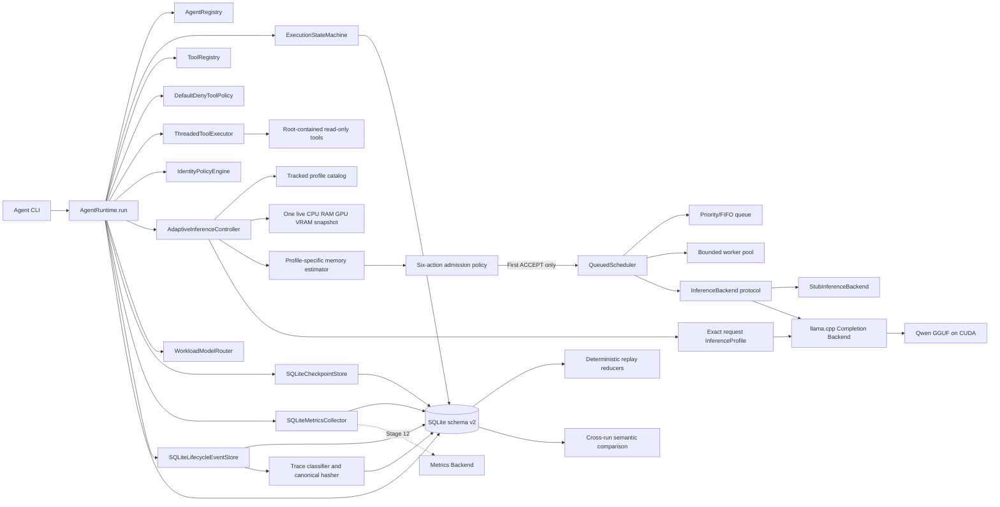

# Architecture Baseline through Stage 11

## Status and scope

Stage 11 upgrades durable lifecycle evidence into hash-chained, task-scoped run
traces and adds side-effect-free deterministic replay/comparison. Stage 10
recovery and all earlier routing, admission, scheduling, and inference boundaries
remain authoritative.

## Context and planned flow



The Stage 1 control flow remains unchanged when the stub is composed. The
Stage 2 inference path is:

1. A typed configuration resolves pinned executable/model paths and validates
   inference settings.
2. Backend startup verifies both SHA-256 hashes and reads the llama.cpp version.
3. A request becomes a raw Qwen ChatML prompt and a bounded native command.
4. One `llama-completion` subprocess starts in offline mode with all model
   layers offloaded to the GPU.
5. Separate readers drain stdout/stderr; text is yielded incrementally while
   llama.cpp timing lines and resource samples are collected.
6. A final chunk carries load, TTFT, prompt, generation, total-time, RAM, and
   VRAM measurements. Cancellation terminates and reaps the owned process.

Only one native inference may run per backend instance. The Stage 6 real
composition therefore configures one scheduler worker instead of admitting
concurrency the backend cannot safely execute.

Stage 3 wraps that path as follows:

1. `AgentRegistry` resolves a stable specialized identity.
2. `AgentRuntime.run()` creates an owned task from the agent/default objective.
3. The runtime requests validated transitions and records ordered history,
   checkpoints, and timestamped lifecycle events.
4. Identity policy and static routing execute through the existing boundaries.
5. The agent system prompt is attached to the inference request.
6. The result carries agent identity, objective, final state, declared
   capabilities, backend metadata, and Stage 2 measurements.
7. Missing/duplicate agents, foreign tasks, illegal transitions, policy denial,
   output rejection, and typed component failures cross the boundary as
   serializable project errors.

Stage 4 normal transition flow:

```text
CREATED -> PLANNING -> EXECUTING -> VALIDATING -> COMPLETED
```

All terminal failure states reject further transitions. The legal graph is centralized in
`runtime/state_machine.py` rather than distributed across runtime branches.

Stage 5 tool-only success flow:

```text
CREATED -> PLANNING -> WAITING_FOR_TOOL -> VALIDATING -> COMPLETED
```

`AgentRuntime.run_tool()` creates an agent-owned task, resolves an exact registry
entry, requires a matching agent grant and every permission declared by the tool,
validates arguments without coercion, and executes the handler with a cooperative
token and deadline. The result identity/schema is validated before completion.
Denied grants and path escapes terminate as `SECURITY_BLOCKED`; bad arguments and
handler failures terminate as `TOOL_FAILED`; timeouts and cancellation use their
existing typed terminal states.

The deterministic lifecycle control flow is:

1. The CLI starts `AgentRuntime` and its injected inference backend.
2. The runtime creates a typed task owned by a typed agent.
3. The identity-only policy verifies task ownership.
4. The static router returns one logical stub model and an explicit reason.
5. The compatibility inline scheduler invokes the deterministic stub backend on the caller thread.
6. The runtime returns a typed result; current Stage 10 composition records
   lifecycle checkpoints/events in SQLite while compatibility compositions use memory.
7. Shutdown stops the backend and returns the runtime to `stopped`.

Stage 6 scheduled inference flow is:

1. `AgentRuntime` supplies workload class, optional explicit priority, an
   end-to-end deadline, and a cancellation token.
2. `QueuedScheduler` assigns sequence and request IDs and records queue position.
3. FIFO selects the oldest request. Priority selects the highest effective
   priority with stable sequence tie-breaking.
4. Wait-time aging raises effective priority; after the configured maximum wait,
   the oldest starved request is selected before newer priority work.
5. A bounded worker executes the operation with its scheduler-owned cooperative
   token. Deadlines cover queue wait plus execution.
6. The runtime result records request status, queue wait, execution time,
   workload, base/effective priority, and timestamps.

Stage 7 inserts this flow before step 2:

1. The profiler captures source-labeled host and device availability.
2. The estimator combines actual model-file metadata, context, offload fraction,
   measured coefficients, and safety reserves.
3. The policy emits one typed action with its reason and recommendation.
4. Only `ACCEPT` reaches scheduler submission. Other actions transition the
   task from `PLANNING` to terminal `RESOURCE_BLOCKED`.

Stage 8 replaces the fixed Stage 7 request with bounded profile selection:

1. Workload class determines the declared profile order.
2. One fresh hardware snapshot is shared across every candidate attempt.
3. Each candidate's exact context and GPU layers are estimated and admitted.
4. The first `ACCEPT` becomes the request's immutable `InferenceProfile`.
5. The backend converts that profile to exact native flags while retaining
   `--fit off`, so llama.cpp does not silently retune the request.
6. Selection attempts, applied flags, admission, scheduler data, and inference
   metrics remain inspectable in events/results.

Stage 9 inserts an explainable route and task budget before scheduler submission:

1. A validated registry derives availability from artifact presence and backend support.
2. The router classifies task type and complexity, then evaluates capability,
   token, memory, latency, queue, and historical benchmark evidence per model.
3. The highest-scoring safe candidate is selected with every rejection retained.
4. The adaptive controller still admits the exact inference profile.
5. The compute gate caps calls/tokens/time and checks profile memory estimates.
6. Route, budget, enforcement, scheduler, and observed usage evidence are returned.

Stage 10 makes that lifecycle durable and adds bounded recovery:

1. Schema v1 transactionally creates SQLite records and narrow protocol adapters.
2. Task creation persists identity before initializing its legal state history.
3. Every accepted transition, checkpoint, event, metric, model configuration,
   tool call, execution step, and output is written with a UTC timestamp.
4. `recovery_ready` marks a `PLANNING` checkpoint before model/tool side effects.
5. Restart reconstructs the task/agent and records `RECOVERING` before planning resumes.
6. Terminal and in-flight side-effect boundaries are retained but refused automatic retry.

Stage 11 makes durable execution evidence traceable and replayable within an
explicit boundary:

1. Schema v2 creates one run per task plus ordered trace steps and replay reports.
2. Each task-scoped lifecycle/output/tool record receives a stable UUID step ID,
   actor/component, UTC time, canonical input/output/semantic hashes, previous
   hash, envelope hash, state/model/configuration fields, and failure metadata.
3. A classifier marks steps `deterministic`, `nondeterministic`,
   `observational`, or `side_effecting`.
4. Replay verifies the full hash chain and reconstructs state using deterministic
   transition reducers; model generation and environmental evidence are observed
   only, while tool side effects are skipped.
5. Comparison aligns event occurrences and uses normalized semantic hashes for
   deterministic matches/divergences while reporting nondeterministic evidence separately.

There is still no real second-model backend, aggregated metrics backend, or API.
SQLite state and traces remain local to one host/runtime database.

## Current component responsibilities

| Component | Current implementation | Owns now | Explicitly deferred |
| --- | --- | --- | --- |
| Agent | Frozen typed role definition | Identity, objective, system prompt, behavior and narrow tool grants | Dynamic configuration and durable grants |
| Agent Registry | SQLite-backed typed snapshots | Stable durable lookup plus conflicting-definition detection | Dynamic discovery and policy versioning |
| Agent Runtime | Synchronous caller API over durable/routed/budgeted/admitted work | Registered tasks, safe recovery, model route, budget, profile, scheduler, and result evidence | External asynchronous task API |
| Task State Machine | SQLite-backed legal graph/history | Transactional transitions, `RECOVERING`, restart reconstruction, terminal enforcement | Distributed coordination |
| Lifecycle events | SQLite append-only records, execution-step mirror, and trace source | Durable timestamped runtime/agent/task/profile/model/scheduler/recovery evidence | Retention/aggregation policy (12) |
| Trace Store | SQLite schema v2 adapter | Run/step identity, canonical hashes, hash chain, determinism and replay reports | Retention, export, redaction, distributed trace context |
| Replay Engine | Side-effect-free verifier and state reducer | Chain/tamper verification, deterministic state reconstruction, explicit nondeterministic/side-effect skips | Native token/tool re-execution is intentionally unsupported |
| Trace Comparator | Event-occurrence semantic comparison | Deterministic match/divergence plus nondeterministic/missing classification | Statistical output-quality comparison/evaluation |
| Inference Backend | Protocol + stub + pinned llama.cpp adapter | Request-scoped profile flags, artifact checks, cancellation, inference metrics | Persistent serving, cross-request batching, multi-model routing |
| Scheduler | Bounded process-local worker queue after admission | FIFO/priority policy, ordering, aging, cancellation, deadlines, metrics; safe tasks are resubmitted after recovery | Queue reconstruction and distributed workers |
| Model Registry | Typed file-backed catalog | Artifact/backend availability, capabilities, token/memory limits, benchmark provenance | Durable discovery and multi-backend activation |
| Model Router | Workload-aware scored implementation; static compatibility adapter retained | Candidate filtering/scoring and full explained route evidence | Learned policy and real multi-model comparison |
| Compute Budget Policy | Typed workload defaults plus task override | Calls, generated tokens, total time, RAM/VRAM ceilings | Durable per-user/project accounting |
| Policy Engine | Identity policy + default-deny tool policy | Task ownership, exact tool grants, required permission sets | OS sandbox and adversarial hardening (14) |
| Tool Registry | Process-local definitions plus durable invocation ledger | Definitions/handlers and persisted request/result/error evidence | Durable/dynamic tool discovery |
| Tool Executor | Bounded daemon-thread adapter | Strict validation, structured results/errors, deadline and cooperative cancellation | Process isolation and forced termination |
| Safe Tools | Project context + fixed risk-register readers | UTF-8 allowlist, character cap, resolved-root containment, read-only access | Writes, subprocesses, and network tools |
| Checkpoint Store | SQLite adapter | Durable transition and `recovery_ready` checkpoints | Broader resumable boundaries after idempotency evidence |
| Metrics Collector | SQLite adapter | Durable named metric events | Aggregated metrics backend and telemetry (12) |
| Runtime Persistence | Shared SQLite schema v2 | Stage 10 records plus trace runs, steps, chain hashes, and replay reports | Backup/restore and multi-process service guarantees |
| Hardware Profiler | Windows/POSIX stdlib plus NVIDIA query | CPU/logical count, RAM availability, GPU/VRAM pressure, source/confidence/warnings | Process-aware GPU attribution and broader platform evidence |
| Memory Estimator | File-backed model plus calibrated coefficients | Profile-specific host/VRAM predictions, assumptions, reserves, measured error | Per-model repeated calibration (9) |
| Admission Gate | Six-action conservative policy | Candidate-specific `ACCEPT` or inspectable resource action | Fallback model routing (9), durable retry |
| Inference Profile Catalog | Four tracked typed profiles | Explicit context, batch/ubatch, threads, GPU layers, flash attention, purpose, and workload order | Learned/expanded profiles only after evidence |
| Adaptive Controller | Workload order plus fresh profile admission after route | Selects the first safe profile and refuses all unsafe candidates | Per-model profile catalogs when a second backend exists |

These interfaces contain only methods exercised by the Stage 11 demonstration.
Later stages should extend them based on executable requirements rather than
anticipating every future feature now.

## Dependency rules

- Core contracts stay independent of llama.cpp, Ollama, FastAPI, React, and SQLite details.
- Adapters implement core contracts and can be replaced in tests.
- Policy decisions and denials cross typed boundaries rather than scattered conditional checks.
- Lifecycle effects emit inspectable SQLite events and hash-chained trace steps;
  replay never repeats model generation or tool side effects.
- Configuration is typed and secrets are never embedded in source-controlled files.
- Agents never obtain unrestricted filesystem, subprocess, or network access by default.

## Failure and concurrency baseline

Detailed mechanisms belong to later stages. Current behavior and constraints are:

- A task has an explicit owner; queued and running scheduler requests accept
  cancellation and map to the existing `CANCELLED` terminal state.
- Queue and execution deadlines map to `TIMEOUT`; active inference receives a
  cooperative cancellation signal when its deadline expires.
- A component failure becomes a structured error rather than an untyped process crash where containment is possible.
- Durable store operations use short SQLite transactions; scheduler queues and
  active workers remain process-local.
- Worker concurrency is bounded, but Python cannot forcibly kill a
  non-cooperative operation thread after timeout or shutdown.
- Unknown RAM yields `REJECT_UNSAFE`; unknown GPU yields a zero-offload
  recommendation only when GPU reduction is allowed.
- Admission arithmetic cannot predict fragmentation or concurrent allocation
  perfectly; explicit reserves and confidence labels limit the claim.
- Shutdown has an explicit lifecycle and must not silently abandon accepted work.

## Alternatives considered

| Alternative | Decision | Reason at baseline |
| --- | --- | --- |
| LangChain/LangGraph as core runtime | Rejected | Hides the runtime mechanics this project must demonstrate |
| Ollama-only architecture | Rejected as flagship | Useful prototype adapter, but insufficient as the serious inference baseline |
| Python-first modular monolith | Selected | Fast iteration with inspectable in-process boundaries; split only with evidence |
| Microservices from Stage 1 | Rejected | Adds operations and failure surface before there is a measured need |
| Premature C++ core | Rejected | Native code requires a profiled bottleneck or systems-level justification |

## Stage boundaries

- Stage 0 establishes evidence and architecture only.
- Stage 1 creates runnable contracts and a fake/minimal lifecycle, not real LLM inference — COMPLETE.
- Stage 2 integrates and measures a real local model — COMPLETE.
- Stage 3 runs two specialized agents through the owned runtime — COMPLETE.
- Stage 4 formalizes detailed states and legal transitions — COMPLETE.
- Stage 5 implements default-deny, typed, bounded safe tools — COMPLETE.
- Stage 6 implements measurable FIFO/priority request scheduling — COMPLETE.
- Stage 7 implements hardware profiling and memory-aware admission — COMPLETE.
- Stage 8 implements adaptive, re-admitted inference profiles — COMPLETE.
- Stage 9 implements model registry, explainable routing, and compute budgets — COMPLETE.
- Stage 10 implements SQLite persistence, checkpoints, and bounded recovery — COMPLETE.
- Stage 11 implements structured execution traces and bounded deterministic replay — COMPLETE.
- Stage 12 may implement an observability and metrics backend after approval.
- Production frontend implementation remains prohibited until Stage 16 is accepted.
