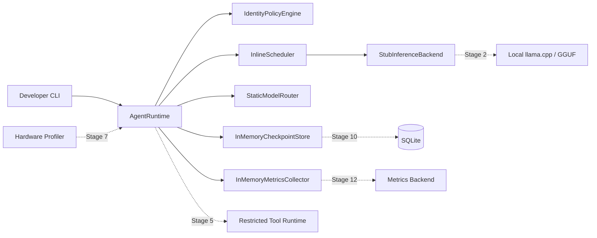

# Architecture Baseline and Stage 1 Skeleton

## Status and scope

Stage 1 implements the solid boxes below through typed Python protocols and
deterministic in-memory components. Dashed connections remain planned. The
stub inference backend never loads or calls a model.

## Context and planned flow

Implemented Stage 1 control flow:

1. The CLI starts `AgentRuntime` and its injected inference backend.
2. The runtime creates a typed task owned by a typed agent.
3. The identity-only policy verifies task ownership.
4. The static router returns one logical stub model and an explicit reason.
5. The inline scheduler invokes the deterministic stub backend on the caller thread.
6. The runtime returns a typed result and records process-local lifecycle checkpoints/events.
7. Shutdown stops the backend and returns the runtime to `stopped`.

There is no admission control, queueing, real model invocation, durable
persistence, tool execution, tracing backend, cancellation, or API in Stage 1.

## Initial component responsibilities

| Component | Stage 1 implementation | Owns now | Explicitly deferred |
| --- | --- | --- | --- |
| Agent | Frozen typed model | Identity, objective, capability declaration | Specialized behavior (3) |
| Agent Runtime | Synchronous orchestrator | Start/create/execute/shutdown composition | Real agent state machine (3–4) |
| Inference Backend | Protocol + deterministic stub | Start/generate/shutdown contract | Load, stream, cancel, metrics (2) |
| Scheduler | Protocol + inline implementation | One caller-thread execution hook | Queue, priority, timeout, cancellation (6) |
| Model Router | Protocol + static implementation | Logical model ID and reason | Registry and dynamic routing (9) |
| Policy Engine | Protocol + identity check | Task/agent ownership check | Tool permissions and sandboxing (5, 14) |
| Checkpoint Store | Protocol + process-local list | Latest lifecycle record | SQLite durability and recovery (10) |
| Metrics Collector | Protocol + process-local list | Named lifecycle events | Metrics backend and telemetry (12) |
| Hardware Profiler | Not implemented | None | Hardware/resource decisions (7) |

These interfaces contain only methods exercised by the Stage 1 demonstration.
Later stages should extend them based on executable requirements rather than
anticipating every future feature now.

## Dependency rules

- Core contracts stay independent of llama.cpp, Ollama, FastAPI, React, and SQLite details.
- Adapters implement core contracts and can be replaced in tests.
- Policy decisions are explicit data, not scattered conditional checks.
- Lifecycle effects emit inspectable in-memory events; deterministic trace guarantees remain deferred.
- Configuration is typed and secrets are never embedded in source-controlled files.
- Agents never obtain unrestricted filesystem, subprocess, or network access by default.

## Failure and concurrency baseline

Detailed mechanisms belong to later stages. Current behavior and constraints are:

- A task has an explicit owner; cancellation is not implemented yet.
- A component failure becomes a structured error rather than an untyped process crash where containment is possible.
- In-memory stores are single-process and make no thread-safety claim.
- Admission is conservative when RAM/VRAM evidence is missing.
- Shutdown has an explicit lifecycle and must not silently abandon accepted work.

## Alternatives considered

| Alternative | Decision | Reason at baseline |
| --- | --- | --- |
| LangChain/LangGraph as core runtime | Rejected | Hides the runtime mechanics this project must demonstrate |
| Ollama-only architecture | Rejected as flagship | Useful prototype adapter, but insufficient as the serious inference baseline |
| Python-first modular monolith | Selected | Fast iteration with inspectable in-process boundaries; split only with evidence |
| Microservices from Stage 1 | Rejected | Adds operations and failure surface before there is a measured need |
| Premature C++ core | Rejected | Native code requires a profiled bottleneck or systems-level justification |

## Stage boundaries

- Stage 0 establishes evidence and architecture only.
- Stage 1 creates runnable contracts and a fake/minimal lifecycle, not real LLM inference — COMPLETE.
- Stage 2 is the first stage allowed to integrate a real local model.
- Production frontend implementation remains prohibited until Stage 16 is accepted.
