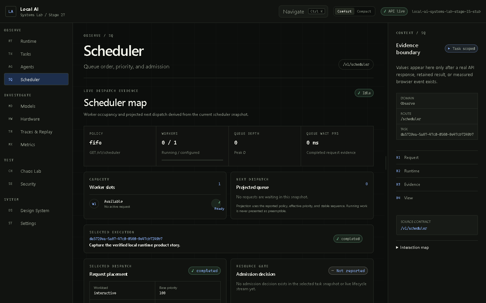
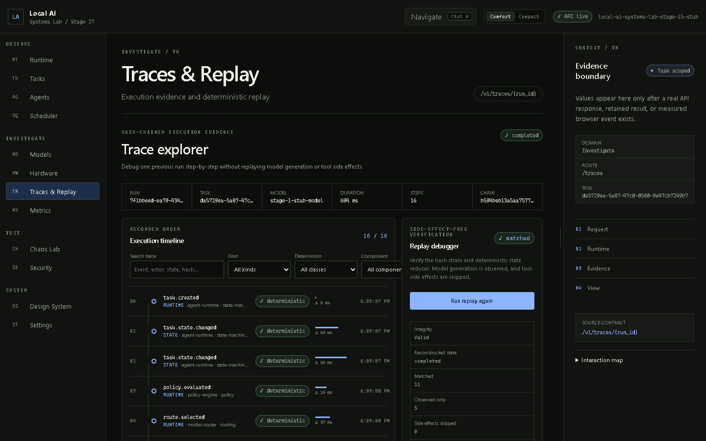
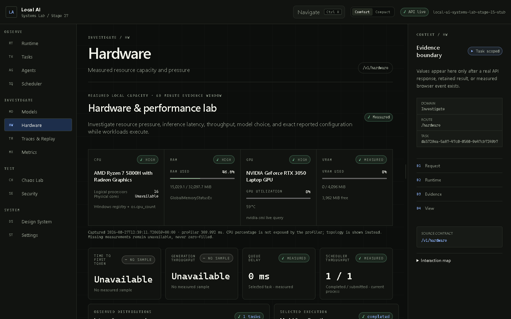
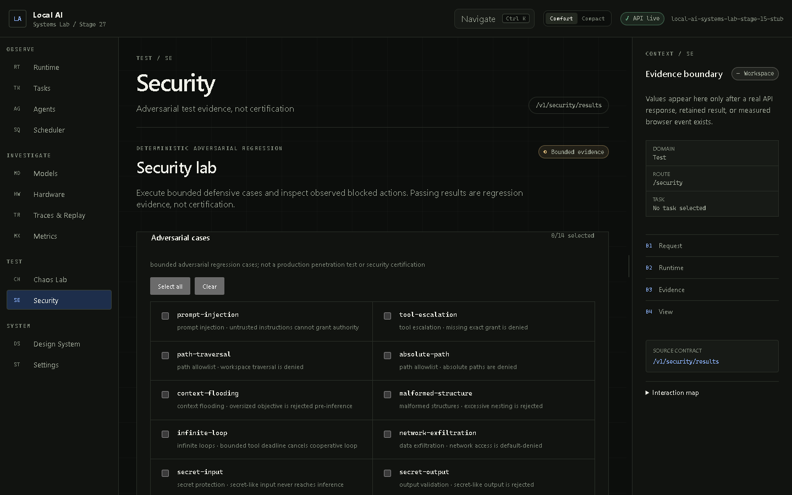

# Demonstration Workflow

## Five-minute demo

Start the deterministic stack with `setup_and_run.bat --stub`, then narrate one
causal execution rather than clicking every screen.

1. **Runtime — 60 seconds.** Open `/runtime`. Point out loopback health, the real
   hardware/model/scheduler evidence, exact agent roles, and the absence of fake
   telemetry. Launch “Explain why local inference and lifecycle evidence matter.”
2. **Scheduler — 45 seconds.** Open `/scheduler?task=<selected-id>`. Follow intake
   through agent ownership, admission, queue placement, execution timing, and
   terminal state. Explain why a single model worker makes ordering observable.
3. **Trace/replay — 60 seconds.** Open `/traces?task=<selected-id>`. Expand a
   state/model step, show redacted hashes and chain links, then run deterministic
   replay. Emphasize that model generation is observed and tool side effects are skipped.
4. **Hardware/performance — 45 seconds.** Open `/hardware?task=<selected-id>`.
   Show source-labelled CPU/RAM/GPU/VRAM, selected-task measurements, retained
   model benchmark fallback, and null-versus-zero treatment.
5. **Safe tool — 45 seconds.** Return to `/runtime`, select Technical Explainer,
   and run `project_context_read` for `PROJECT_STATE.md`. Show exact grant,
   path restriction, bounded output, durable task ID, telemetry, and tool trace.
6. **Reliability/security — 45 seconds.** Open `/chaos` and `/security`. Explain
   explicit confirmation, separate deterministic databases, expected-versus-
   actual outcomes, blocked actions, and why PASS is not certification.

## What the audience should understand

The central story is:

```text
user action
  -> typed loopback API
  -> agent/runtime state machine
  -> admission + scheduler + router + model/tool policy
  -> SQLite + telemetry + hash-chained trace
  -> inspectable frontend projection
```

The UI is not the authority. It projects server-owned contracts, keeps missing
evidence unavailable, and does not manufacture task history or security claims.

## Extended technical demo

After the five-minute path:

- Compare FIFO and priority behavior with `python -m runtime.scheduler_cli`.
- Show all six admission outcomes with `python -m runtime.hardware_cli`.
- Compare resource profiles with the retained [Stage 8 result](../../benchmarks/results/stage8-profile-comparison-20260824T122355Z.json).
- Demonstrate killed-worker recovery with `python -m runtime.recovery_cli`.
- Run the deterministic chaos suite with `python -m runtime.chaos_cli --execute`.
- Run the adversarial suite with `python -m runtime.security_cli`.
- Finish with `python -m benchmarks.run_stage26_product_acceptance` or show its
  retained [release evidence](../../benchmarks/results/stage26-product-acceptance-20260827T101438Z.json).

## Screenshots










## Demo failure recovery

- If real model setup is absent, switch to `--stub` and explicitly say the real
  claim comes from retained Stage 26 evidence.
- If 8765 or 4173 is occupied by an unknown process, stop and inspect it; the
  launcher intentionally refuses to kill it.
- If a task ID is lost, launch another task. Do not claim a global task list; the
  API does not expose one.
- If physical-core or an inference sample is unavailable, show the unavailable
  label as evidence of honest null handling rather than hiding it.
